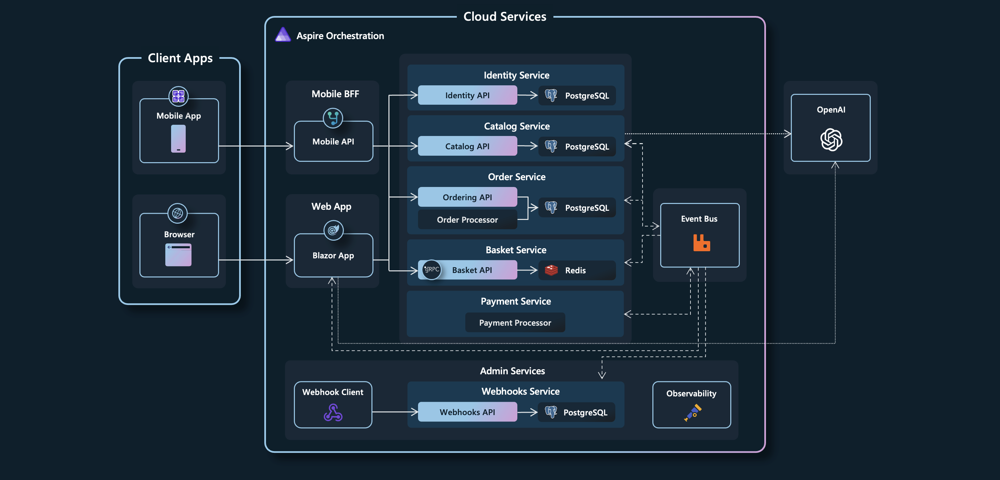

# GoSell Reference Application - "https://local.gosell.com/"

A reference .NET application implementing an eCommerce web site using a services-based architecture.

## Getting Started

### Prerequisites

- Clone the GoSell repository:http://git.mediastep.com/gosell_software/gosell-services-ne
- (Windows only) Install Visual Studio. Visual Studio contains tooling support for .NET Aspire that you will want to have. [Visual Studio 2022 version 17.9 Preview](https://visualstudio.microsoft.com/vs/preview/).
  - During installation, ensure that the following are selected:
    - `ASP.NET and web development` workload.
    - `.NET Aspire SDK` component in `Individual components`.
- Install the latest [.NET 8 SDK](https://github.com/dotnet/installer#installers-and-binaries)
- Install PosgresSQL

### Running the solution

* (Windows only) Run the application from Visual Studio:
 - Open the `GoSell.slnf` file in Visual Studio
 - Hit Ctrl-F5 to launch Aspire

* Add new row in host file (Window: c:\Windows\System32\Driver\etc\host):
- 127.0.0.1     local.gosell.com

* Browser to address: https://local.gosell.com/swagger/index.html (if SSL false, disable security browser or using Chrome low version)

dotnet ef dbcontext scaffold "Server=210.2.68.52,2433;Database=ERPOutsource;User Id=osrw;Password=P6RYhk4RFrrebRWrvhf9mQ==;TrustServerCertificate=True;" Microsoft.EntityFrameworkCore.SqlServer -o Database/Entities --project ./RP.GobalCore/RP.GobalCore.csproj